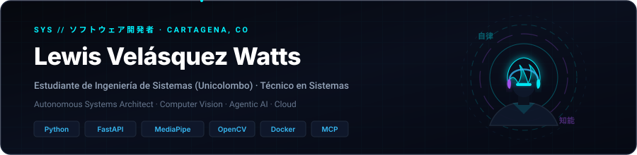
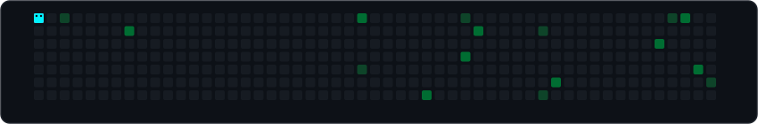

  

**Software Engineer &amp; AI Systems Developer • Cartagena, Colombia 🇨🇴**  
Construyo aplicaciones inteligentes de alto impacto, visión artificial perimetral, agentes autónomos y pipelines de analítica predictiva. Python · FastAPI · Computer Vision · Docker.

[**Portfolio**](https://github.com/Levelasquez15) &nbsp;·&nbsp;
[**LinkedIn**](https://www.linkedin.com/in/) &nbsp;·&nbsp;
[**Email**](mailto:lewis.velasquezwatts@unicolombo.edu.co) &nbsp;·&nbsp;
[**X**](https://x.com/)

---

### Stack

  

  <b>También:</b> Google MediaPipe · Model Context Protocol (MCP) · python-telegram-bot · Streamlit · FFmpeg · Faster-Whisper · Arquitectura Hexagonal &amp; DDD · Capacitor Android

---

### Projects

| Proyecto | Qué es | Stack |
| :--- | :--- | :--- |
| **[Pausas Activas & SmartBreak](https://github.com/Levelasquez15/Pausas-activas)** | Sistema inteligente de escritorio para ergonomía laboral con visión artificial perimetral en MediaPipe Pose, OpenCV, Coach Virtual y gamificación interactiva. | `Python` `MediaPipe` `OpenCV` `SQLite` |
| **[BetBot - Telegram Sports Analytics](https://github.com/Levelasquez15/bet_bot)** | Agente predictivo de fútbol en Telegram con modelos matemáticos Poisson + Elo, dashboard interactivo en Streamlit, contenedor Docker y CI/CD en Azure. | `Python` `Telegram Bot` `Streamlit` `Docker` `Azure` |
| **[Grafo Fábrica Agéntico](https://github.com/Levelasquez15/Grafo--fabica)** | Ecosistema vivo de ingeniería agéntica y grafo de conocimiento en Obsidian con más de 1,220 nodos interconectados, 518 tools atómicas, catálogo MCP y test harness estricto. | `Python` `MCP` `Obsidian API` `Agentic AI` |
| **[Agente Clínico de Enfermería](https://github.com/Levelasquez15)** | Asistente clínico inteligente y triage asistido por IA multimodal (Google GenAI), digitalización de registros médicos y gestión de conocimiento clínico con arquitectura OKF. | `FastAPI` `Python` `Multimodal AI` `OKF` |
| **[AutoClips AI Studio](https://github.com/Levelasquez15)** | Pipeline autónomo para transformar videos horizontales largos en clips verticales virales (9:16) con transcripción por IA (Faster-Whisper), análisis de momentos clave y renderizado dinámico con FFmpeg. | `Python` `Faster-Whisper` `FFmpeg` `Virality Engine` |
| **[Arquitectura Hexagonal Pura](https://github.com/Levelasquez15/crud-php)** | Aplicación desarrollada en PHP puro (sin frameworks externos) implementando rigurosamente Arquitectura Hexagonal (Puertos y Adaptadores) y Domain-Driven Design (DDD). | `PHP Vanilla` `Hexagonal Arch` `DDD` `MySQL` |
| **[Perfume Store Mobile App](https://github.com/Levelasquez15/Frontend-Perfume-New)** | Aplicación móvil multiplataforma para e-commerce desarrollada con Angular, componentes UI de Ionic y compilación nativa para Android mediante Capacitor. | `Angular` `Ionic` `Capacitor Android` `TypeScript` |

---

  

