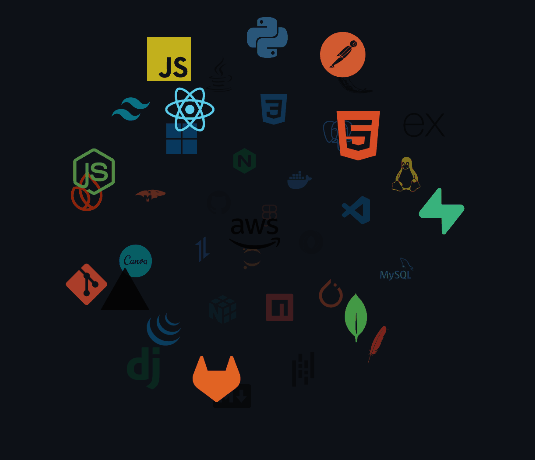
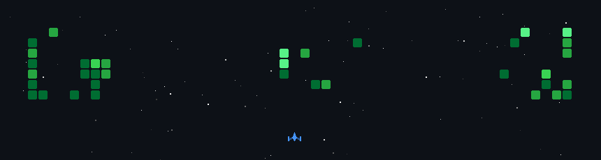

<!-- GitAscii Telemetry Deck Banner -->

  

<!-- Live Animated Typing Terminal -->

  

**Arquitecto de Software &amp; Sistemas Autónomos • Cartagena, Colombia 🇨🇴**  
*Estudiante de Ingeniería de Sistemas (Unicolombo) &nbsp;·&nbsp; Técnico en Sistemas*

 

 

---

<!-- Floating Orbital Stack & Current Focus Section -->
<h2 align="center">⚡ Tᴇᴄʜ Sᴛᴀᴄᴋ &amp; Eɴɢɪɴᴇᴇʀɪɴɢ Fᴏᴄᴜs</h2>

<picture>
  <source media="(prefers-color-scheme: dark)" srcset="assets/Skills_Animation_Dark.gif">
  <source media="(prefers-color-scheme: light)" srcset="assets/Skills_Animation_White.gif">
  
</picture>

 

<h3 align="left">🧠 Current Learning &amp; Research</h3>
<ul align="left">
  <li><b>Inteligencia Artificial &amp; Visión Perimetral:</b> Google MediaPipe Pose (33 Landmarks 3D), OpenCV, Faster-Whisper CUDA &amp; Google Gemini Multimodal.</li>
  <li><b>Model Context Protocol (MCP) &amp; Agentes:</b> Orquestación agéntica con herramientas contextuales, streaming y LLMs multimodales.</li>
  <li><b>Arquitectura de Software:</b> Arquitectura Limpia Hexagonal (Puertos y Adaptadores) y Domain-Driven Design (DDD) con microservicios async (FastAPI / Pydantic v2).</li>
  <li><b>Sistemas Móviles &amp; PWA:</b> Arquitectura Offline-First, IndexedDB Local Storage, Ionic &amp; Capacitor Android.</li>
</ul>

<h3 align="left">🛠️ Core Engineering Arsenal</h3>

  

 
 

---

<!-- Live Telemetry & GitHub Activity Deck -->
<h3 align="center">📊 GɪᴛHᴜʙ Tᴇʟᴇᴍᴇᴛʀʏ &amp; Aᴄᴛɪᴠɪᴛʏ</h3>

  
  

  

---

<!-- Featured Engineering Projects -->
<h3 align="center">🚀 Fᴇᴀᴛᴜʀᴇᴅ Eɴɢɪɴᴇᴇʀɪɴɢ Pʀᴏᴊᴇᴄᴛs</h3>

  
  

  
  

<b>📂 Catálogo Extendido de Soluciones y Arquitecturas</b>

 

* 🤖 **[Agente Clínico de Enfermería](https://github.com/Levelasquez15):** Sistema de valoración clínica y triage asistido por IA multimodal (Google GenAI), dictados de voz y digitalización médica con arquitectura OKF. *(FastAPI · Python · Multimodal AI · OKF)*
* 🎬 **[AutoClips AI Studio](https://github.com/Levelasquez15):** Pipeline autónomo para transformar videos horizontales en clips verticales virales (9:16) con transcripción Faster-Whisper y renderizado FFmpeg NVENC. *(Python · Whisper · FFmpeg)*
* 📋 **[Extractor Encuestas de Salud](https://github.com/Levelasquez15):** Digitalizador móvil PWA Offline-First para encuestas de 64 columnas con visión Gemini y Google Apps Script. *(PWA · FastAPI · IndexedDB)*
* 📱 **[Perfume Store Mobile App](https://github.com/Levelasquez15/Frontend-Perfume-New):** Aplicación móvil multiplataforma para Android desarrollada con Angular, componentes UI de Ionic y compilación nativa con Capacitor. *(Angular · Ionic · Capacitor Android)*

---

<!-- Space Shooter Game -->
<h3 align="center">👾 Sᴘᴀᴄᴇ Sʜᴏᴏᴛᴇʀ // GɪᴛHᴜʙ Cᴏɴᴛʀɪʙᴜᴛɪᴏɴs</h3>

  

